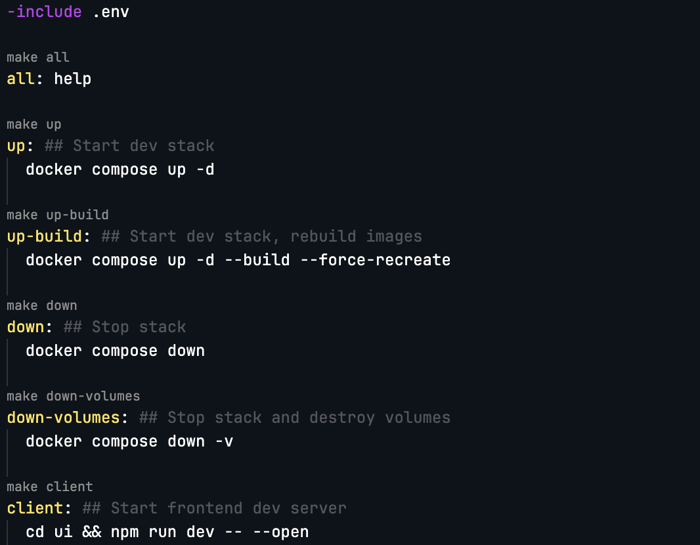

## Makefile Buttons Improved

Fork of [Makefile buttons](https://marketplace.visualstudio.com/items?itemName=hablof.makefile-buttons) with a couple quality-of-life fixes - each click opens a fresh terminal already cd'd to the makefile's directory, so you don't run into issues with occupied terminals or wrong working directories.

### Features

Adds codelens buttons to your makefiles to run targets by mouse click.

